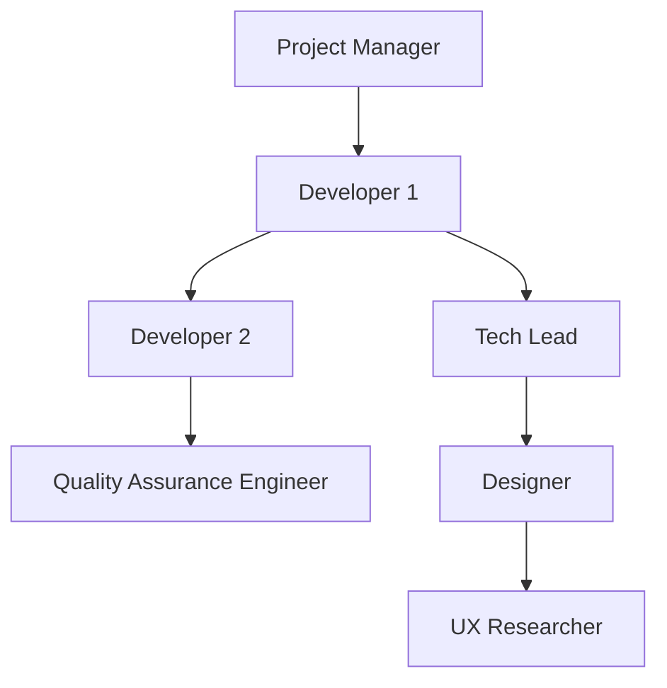

# Mermaid Js - Software Development Team

mermaidjs diagram describing the roles and responsibilities of a development team

Here is an example of a Mermaid diagram that describes the roles and responsibilities of a development team:
 kwietniu 12, 2023
 

In this diagram, the roles and responsibilities of a development team are represented as nodes (A, B, C, D, E, F, and G) connected by directed edges. Each node represents a specific role within the team:

* A: Project Manager - responsible for overseeing the entire project, managing resources, and ensuring timely delivery of the project.
* B: Developer 1 - responsible for developing the software, writing code, and testing it.
* C: Tech Lead - acts as a mentor to developers, provides technical guidance, and helps in resolving technical issues.
* D: Developer 2 - similar to Developer 1, but with a different area of focus.
* E: Quality Assurance Engineer - responsible for testing the software to ensure it meets quality standards, identifying defects, and reporting them to the development team.
* F: Designer - responsible for designing the user interface and experience of the software, creating wireframes, mockups, and prototypes.
* G: UX Researcher - responsible for conducting research on user behavior, preferences, and needs to inform design decisions.

The diagram shows the relationships between the different roles within the team, including reporting relationships (e.g., Developer 1 reports to Project Manager), collaboration relationships (e.g., Tech Lead collaborates with Developers), and coordination relationships (e.g., Quality Assurance Engineer works closely with Developers).

By using a diagram like this, you can quickly and easily visualize the structure of a development team and understand the roles and responsibilities of each member. This can help in communication, planning, and decision-making within the team.