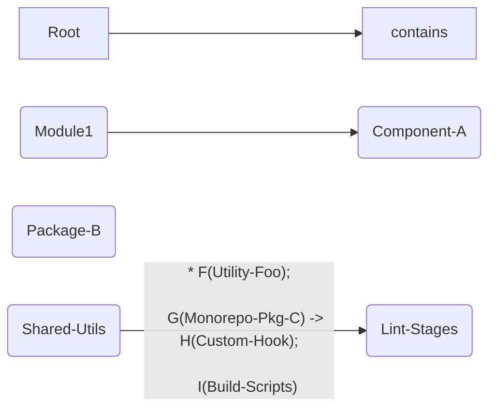

# Mermaid JS

A project that can create diagrams from markdown multiline comments.  Works in github for enhanced documentation visualization

## Example

```mermaid
graph LR;
    A[Root] --> contains
        B(Module1) -->
            C(Component-A)
            D(Package-B)

    E(Shared-Utils) --* F(Utility-Foo);
    
    G(Monorepo-Pkg-C) -> H(Custom-Hook);

    I(Build-Scripts) --> J(Lint-Stages);
```
